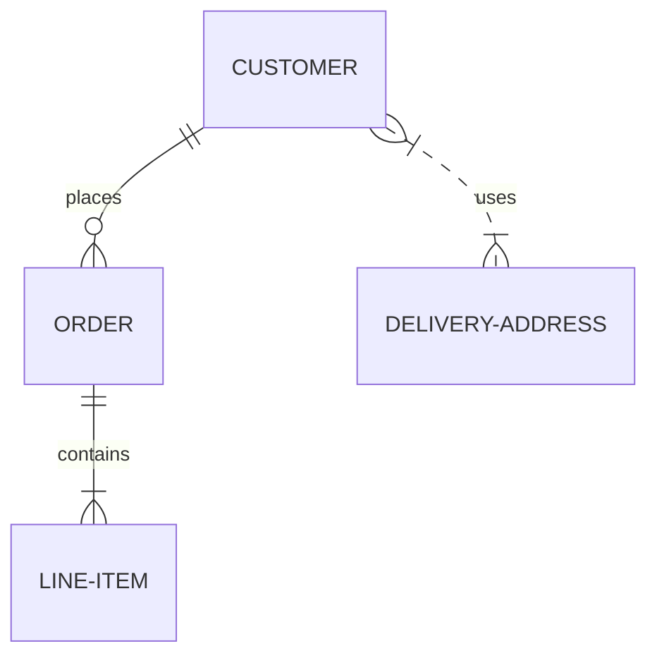

* toc
{:toc}

## Enable mermaid rendering

reference [https://jackgruber.github.io/2021-05-09-Embed-Mermaid-in-Jekyll-without-plugin/](https://jackgruber.github.io/2021-05-09-Embed-Mermaid-in-Jekyll-without-plugin/)

With `mermaid: true` you can now enable the rendering of mermaid diagrams in your post or page.
This has the advantage that the relatively large `mermaid.min.js` is only loaded when it is needed.

## Writing a mermaid diagram

[https://mermaid.js.org/syntax/examples.html](https://mermaid.js.org/syntax/examples.html)

You can now write a mermaid diagram like this in your site or posts.

<pre>

</pre> 

Which are rendered automatically


Entity relationship diagram 

<pre>

</pre> 


## Math Symbols with MathJax

reference [https://jojozhuang.github.io/tutorial/jekyll-math-symbols-with-mathjax/](https://jojozhuang.github.io/tutorial/jekyll-math-symbols-with-mathjax/)

### Showing Math Symbols on Web Page
The support of displaying math symbols with html tags is limited. Though you can use UTF-8 to display some special characters, it is hard to remember them and it is inconvenient to use.

Title                   | Formula                 | HTML Tag
------------------------|-------------------------|--------------------------------------
Square                  | n<sup>2</sup>           | `n<sup>2</sup>`
Square Root             | &radic;, &#8730;        | `&radic;`, or `&#8730;`
Summary                 | &sum;, &#8721;          | `&sum;`, or `&#8721;`

* [UTF-8 Mathematical Operators](https://www.w3schools.com/charsets/ref_utf_math.asp)

### MathJax
[MathJax](https://www.mathjax.org/) is a cross-browser JavaScript library that displays mathematical notation in web browsers.

With `mathjax: true` you can now enable the rendering of mathjax expressions in your post or page.


1) Example One:
Construct the formula with following markdown.
```raw
$a^2 + b^2 = c^2$
```
Then you will get the formula as follows.

$a^2 + b^2 = c^2$

2) Example Two:
Construct the formula with following markdown.
```raw
$ x = {-b \pm \sqrt{b^2-4ac} \over 2a} $
```
Then you will get the formula as follows.

$ x = {-b \pm \sqrt{b^2-4ac} \over 2a} $

3) Example Three:
Construct the formula with following markdown.
```raw
$$\begin{eqnarray}
x' &=& &x \sin\phi &+& z \cos\phi \\
z' &=& - &x \cos\phi &+& z \sin\phi \\
\end{eqnarray}$$
```
Then you will get the formula as follows.

$$\begin{eqnarray}
x' &=& &x \sin\phi &+& z \cos\phi \\
z' &=& - &x \cos\phi &+& z \sin\phi \\
\end{eqnarray}$$

Here are some notes about the above example:
* The inline formula is between `$ ... $`.
* The display formula is between `$$ ... $$`.
* You can use the math envrionment directly, for example, `\begin{equation}...\end{equation}` or `\begin{align}...\end{align}`.
* Whenever in the inline math or display math, the star character `*` must be escaped.
* In the multi-lines display math, the line break symbol double-backslash `\\` should be escaped, i.e., use four backslash `\\\\`.
* If you found error while typesetting math formula, try to escape some special characters.

## Source code highlighting
some of the supported language identifiers : **java, javascript, html, c, cpp, ruby, xml, yaml, json, clojure, smalltalk**

<pre>
```java
    // A method that sorts an array of integers using bubble sort algorithm
    public static void bubbleSort(int[] array) {
        // Get the length of the array
        int n = array.length;
        // Loop through the array from the first element to the second last element
        for (int i = 0; i < n - 1; i++) {
            // Loop through the array from the first element to the last element that is not sorted yet
            for (int j = 0; j < n - i - 1; j++) {
                // Compare the current element with the next element
                if (array[j] > array[j + 1]) {
                    // Swap them if the current element is larger than the next element
                    int temp = array[j];
                    array[j] = array[j + 1];
                    array[j + 1] = temp;
                }
            }
        }
    }
```
</pre>
```java
    // A method that sorts an array of integers using bubble sort algorithm
    public static void bubbleSort(int[] array) {
        // Get the length of the array
        int n = array.length;
        // Loop through the array from the first element to the second last element
        for (int i = 0; i < n - 1; i++) {
            // Loop through the array from the first element to the last element that is not sorted yet
            for (int j = 0; j < n - i - 1; j++) {
                // Compare the current element with the next element
                if (array[j] > array[j + 1]) {
                    // Swap them if the current element is larger than the next element
                    int temp = array[j];
                    array[j] = array[j + 1];
                    array[j + 1] = temp;
                }
            }
        }
    }
```

## Displaying line numbers for highlighted code 


<pre>

    public class HelloWorld {
        public static void main(String[] args) {
            System.out.println("Hello World!");
        }
    }

</pre>




    public class HelloWorld {
        public static void main(String[] args) {
            System.out.println("Hello World!");
        }
    }



