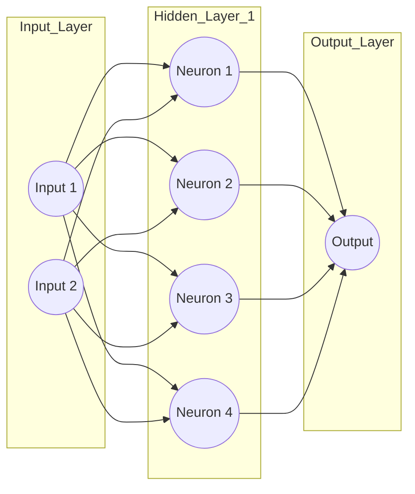
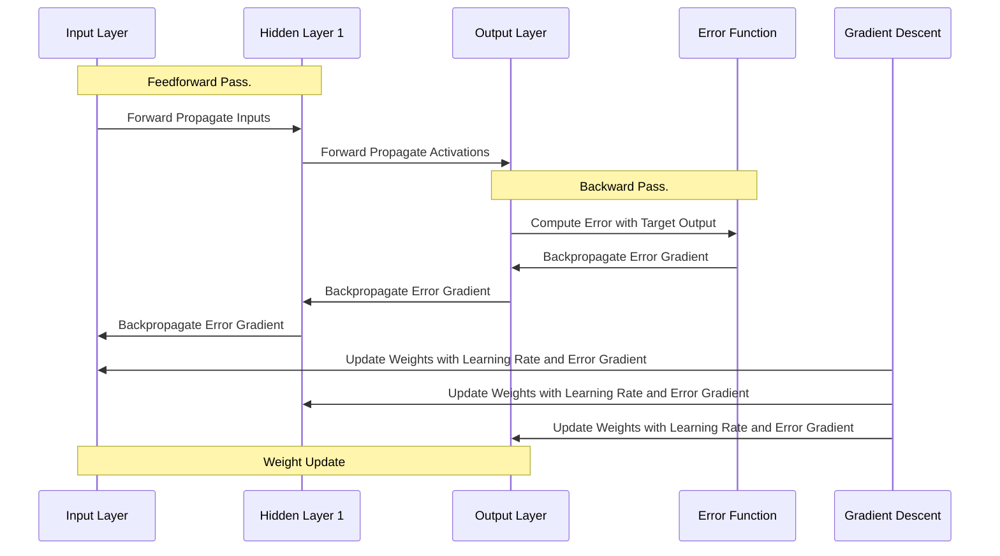

In today's era of expansive libraries and frameworks, the idea of crafting a **neural network** `from scratch` might seem daunting. Even more so, doing it in a **single file**? Almost unheard of! Yet, with the power of `jbang` and the versatility of **Java**, this  task becomes not only feasible but also engaging. Dive in with me as we unravel the intricacies of neural networks, push the boundaries of traditional coding structures, and demonstrate that sometimes, less is indeed more.

Neural networks are an essential cornerstone of artificial intelligence. Today, we'll walk through a Java implementation that's based on a C++ implementation by David Miller. You can read the original post [here](https://millermattson.com/dave/?p=54). If you want to learn more about the C++ version, there is an amazing video tutorial ['Neural Net in C++ Tutorial'](https://vimeo.com/19569529) and a follow-up ['The Care and Training of Your Backpropagation Neural Net.'](https://vimeo.com/56882963). In my Java version of the implementation, I've tried to preserve as much as possible from the original comments, field and method names. 

Why do we need a minimal implementation that actually works? I think it's useful to have a simple and functional example in Java. Let's dive in!

* toc
{:toc}

# Prerequisites
Before we dive into the development process, ensure you have:
* JBang installed on your system. You can install it from [JBang's official website](https://www.jbang.dev/download/).

* You can clone the `https://github.com/dmakariev/examples` repository.
```bash
git clone https://github.com/dmakariev/examples.git
cd examples/artificial-intelligence/neural-network-jbang
```

# What is a Neural Network 
**Neural Networks** are a set of algorithms, modeled loosely after the human brain, designed to recognize patterns. They interpret sensory data through a kind of machine perception, labeling, or clustering of raw input. These algorithms adaptively learn from data like our brain learns from experiences. It's **essentially a system of probabilities** that takes data as input and processes it in complex ways to recognize patterns and make decisions based on it.

## Diagram
Here's a simple diagram to represent a neural network:


## Equation for the Output of a Neuron
When it comes to the mathematics behind a neural network, it mainly revolves around the weight adjustments using a process called backpropagation. The equation for the output of a neuron is given by:

$ y = f\left(w_1 x_1 + w_2 x_2 + \cdots + w_n x_n + b\right) $ 

which is equivalent to  

$ y = f\left(\sum_{i=1}^n w_i x_i + b\right) $

Where : 
* $ x_1, x_2, \cdots x_n $  are the inputs.
* $ w_1, w_2, \cdots w_n $ are the weights.
* $ b $ is is the bias.
* $ f $ is some activation function, like hyperbolic tangent, Leaky ReLU, sigmoid, etc. 
* $ y $ is the final output of the neuron

## Common Activation Functions 
#### Sigmoid (Logistic) Activation Function
$ f(z) = \frac{1}{1 + e^{-z}} $

#### Hyperbolic Tangent (tanh) Activation Function
$ f(z) = \tanh(z) $

#### ReLU (Rectified Linear Unit) Activation Function
$ f(z) = \max(0, z) $

#### Leaky ReLU Activation Function
$ \\text{LeakyReLU}(x) = \\begin{cases} x, & \\text{if } x \\geq 0 \\\\ \\alpha x, & \\text{otherwise} \\end{cases} $

where $\alpha$ is a small positive constant that determines the slope of the negative part of the function. The Leaky ReLU activation function is a variation of the ReLU activation function, which has a zero slope for negative values. The Leaky ReLU activation function helps to prevent the problem of dying neurons, which occurs when some neurons stop responding to inputs and produce zero outputs. By having a small slope for negative values, the Leaky ReLU activation function ensures that the neurons always have some gradient and can learn from the data.

## Backpropagation
`Backpropagation`, short for "backward propagation of errors," is a method used for training artificial neural networks, especially feedforward neural networks. It is a supervised learning algorithm that allows the model to adjust its weights based on the error of its predictions.

**How Backpropagation Works:**

**Forward pass:** Input is passed through the network to get the output. This involves passing the input through each layer and using weights, biases, and activation functions to get the output.

**Calculate the loss:** Once the output is obtained, the loss or error is computed using a loss function, comparing the predicted output to the actual target values.

**Backward pass:** The error is propagated backward through the network. This involves computing the gradient of the loss function with respect to each weight by the chain rule.

**Weight update:** Once the gradients are obtained, the weights are updated using optimization techniques like gradient descent.



And, I'll skip the mathematics 😁, let's do some coding !

# Creating the Neural Network
Let's create the files for the Neural Network  
Follow these steps:

## Initialize a New Directory  
Create a new directory for your project and navigate to it using your terminal. Then, create :
* an empty JBang script file with a `.java` extension - `NeuralNetTutorial.java`.
* an empty JBang script file with a `.java` extension - `makeTrainingSamples.java`.


```bash
mkdir neural-network-jbang
cd neural-network-jbang
touch NeuralNetTutorial.java
touch makeTrainingSamples.java

```

## Write the Neural Network Code
Open the `NeuralNetTutorial.java` file in your favorite text editor or integrated development environment (IDE) and add the following code.

```java
//usr/bin/env jbang "$0" "$@" ; exit $?
package com.makariev.examples.ai.neuralnet;

import java.util.ArrayList;
import java.util.Random;
import java.io.BufferedReader;
import java.nio.file.Files;
import java.nio.file.Paths;
import java.util.Arrays;
import java.util.List;

//translated and adapted by Dimitar Makariev https://makariev.com
//
// this is based on the C++ implementation by David Miller, http://millermattson.com/dave
// neural-net-tutorial.cpp
// here is a link to the original article https://millermattson.com/dave/?p=54 
// 'Neural Net in C++ Tutorial' from David Miller on Vimeo.
// See the original associated video for instructions: http://vimeo.com/19569529
// There is a second video 'The Care and Training of Your Backpropagation Neural Net.'
// it's available here : http://vimeo.com/technotes/neural-net-care-and-training
public class NeuralNetTutorial {

    // Silly class to read training data from a text file -- Replace This.
    // Replace class TrainingData with whatever you need to get input data into the
    // program, e.g., connect to a database, or take a stream of data from stdin, or
    // from a file specified by a command line argument, etc.
    static class TrainingData {

        private final String fileName;
        private final List<Integer> topology;

        public TrainingData(String fileName) {
            this.fileName = fileName;
            this.topology = readTopology(fileName);
        }

        public List<Integer> getTopology() {
            return this.topology;
        }

        @FunctionalInterface
        public interface TrainingDataConsumer {

            void accept(int trainingPass, List<Double> inputVals, List<Double> targetVals);
        }

        public void apply(TrainingDataConsumer consumer) {
            try (BufferedReader br = Files.newBufferedReader(Paths.get(fileName))) {
                validateTopologyLine(br.readLine()); //reading and skipping the first line 
                int trainingPass = 0;
                while (br.ready()) {
                    ++trainingPass;
                    final List<Double> inputVals = parseDoubleLine("in:", br.readLine(), trainingPass);
                    final List<Double> targetVals = parseDoubleLine("out:", br.readLine(), trainingPass);

                    consumer.accept(trainingPass, inputVals, targetVals);
                }
            } catch (Exception ex) {
                throw new IllegalArgumentException("Unable to process training data, exception accured:", ex);
            }
        }

        private static List<Integer> readTopology(String fileName) {
            try (BufferedReader br = Files.newBufferedReader(Paths.get(fileName))) {
                final String line = validateTopologyLine(br.readLine());
                return Arrays.asList(line.split(" ")).stream().skip(1).map(Integer::parseInt).toList();
            } catch (Exception ex) {
                throw new IllegalArgumentException("Expected topology data, but exception accured:", ex);
            }
        }

        private static String validateTopologyLine(final String line) {
            if (line == null || !line.startsWith("topology:")) {
                throw new IllegalArgumentException("Expected topology data, but found '" + line + "'");
            }
            return line;
        }

        private static List<Double> parseDoubleLine(final String prefix, final String line, int trainingPass) {
            if (line == null || !line.startsWith(prefix)) {
                throw new IllegalArgumentException("Expected '" + prefix + "' data, but found '" + line + "' on trainingPass=" + trainingPass);
            }

            return Arrays.asList(line.split(" ")).stream().skip(1).map(Double::parseDouble).toList();
        }
    }

    static class Connection {

        double weight;
        double deltaWeight;

        public Connection(double weight, double deltaWeight) {
            this.weight = weight;
            this.deltaWeight = deltaWeight;
        }
    }

    // ****************** class Neuron ******************
    static class Neuron {

        private static final double ETA = 0.15;    // overall net learning rate, [0.0..1.0]
        private static final double ALPHA = 0.5;   // momentum, multiplier of last deltaWeight, [0.0..1.0]
        private static final Random rand = new Random();

        private final List<Connection> outputWeights;
        private final int myIndex;
        private double outputVal;
        private double gradient;

        public Neuron(int numOutputs, int myIndex) {
            this.outputWeights = new ArrayList<>();
            this.myIndex = myIndex;

            for (int c = 0; c < numOutputs; ++c) {
                outputWeights.add(new Connection(randomWeight(), 0));
            }
        }

        public void setOutputVal(double val) {
            outputVal = val;
        }

        public double getOutputVal() {
            return outputVal;
        }

        public void feedForward(List<Neuron> prevLayer) {
            double sum = 0.0;

            // Sum the previous layer's outputs (which are our inputs)
            // Include the bias node from the previous layer.
            for (Neuron neuron : prevLayer) {
                sum += neuron.getOutputVal()
                        * neuron.outputWeights.get(myIndex).weight;
            }

            outputVal = transferFunction(sum);
        }

        public void calcOutputGradients(double targetVal) {
            double delta = targetVal - outputVal;
            gradient = delta * transferFunctionDerivative(outputVal);
        }

        public void calcHiddenGradients(List<Neuron> nextLayer) {
            double dow = sumDOW(nextLayer);
            gradient = dow * transferFunctionDerivative(outputVal);
        }

        public void updateInputWeights(List<Neuron> prevLayer) {

            // The weights to be updated are in the Connection container
            // in the neurons in the preceding layer
            for (Neuron neuron : prevLayer) {
                double oldDeltaWeight = neuron.outputWeights.get(myIndex).deltaWeight;

                double newDeltaWeight
                        = // Individual input, magnified by the gradient and train rate:
                        ETA
                        * neuron.getOutputVal()
                        * gradient
                        // Also add momentum = a fraction of the previous delta weight;
                        + ALPHA
                        * oldDeltaWeight;

                neuron.outputWeights.get(myIndex).deltaWeight = newDeltaWeight;
                neuron.outputWeights.get(myIndex).weight += newDeltaWeight;
            }
        }

        private static double transferFunction(double x) {
            // tanh - output range [-1.0..1.0]
            //return Math.tanh(x); //hyperbolic tangent activation function
            return (x > 0) ? x : x * 0.01; //Leaky rectified linear unit (Leaky ReLU) activation function
        }

        private static double transferFunctionDerivative(double x) {
            // tanh derivative
            //return 1.0 - x * x; //hyperbolic tangent function derivative
            return (x > 0) ? 1.0 : 0.01; //Leaky rectified linear unit (Leaky ReLU)
        }

        private static double randomWeight() {
            return rand.nextDouble();
        }

        private double sumDOW(List<Neuron> nextLayer) {
            double sum = 0.0;

            // Sum our contributions of the errors at the nodes we feed.
            for (int n = 0; n < nextLayer.size() - 1; ++n) {
                sum += outputWeights.get(n).weight * nextLayer.get(n).gradient;
            }

            return sum;
        }
    }

    // ****************** class Net ******************
    static class Net {

        private final List<List<Neuron>> layers; // m_layers[layerNum][neuronNum]
        private double error;
        private double recentAverageError;

        // Number of training samples to average over
        private static final double RECENT_AVERAGE_SMOOTHING_FACTOR = 100.0;

        public Net(List<Integer> topology) {
            layers = new ArrayList<>();

            for (int layerNum = 0; layerNum < topology.size(); ++layerNum) {
                layers.add(new ArrayList<>());
                int numOutputs = (layerNum == topology.size() - 1) ? 0 : topology.get(layerNum + 1);

                // We have a new layer, now fill it with neurons, and
                // add a bias neuron in each layer. ( pay attention to '<=' )
                for (int neuronNum = 0; neuronNum <= topology.get(layerNum); ++neuronNum) {
                    layers.get(layerNum).add(new Neuron(numOutputs, neuronNum));
                    System.out.println("Made a Neuron!");
                }

                // Force the bias node's output to 1.0 (it was the last neuron pushed in this layer):
                layers.get(layerNum).get(topology.get(layerNum)).setOutputVal(1.0);
            }
        }

        public void feedForward(List<Double> inputVals) {

            if (inputVals.size() != layers.get(0).size() - 1) {
                throw new IllegalStateException();
            }

            // Assign (latch) the input values into the input neurons
            for (int i = 0; i < inputVals.size(); ++i) {
                layers.get(0).get(i).setOutputVal(inputVals.get(i));
            }

            // forward propagate
            for (int layerNum = 1; layerNum < layers.size(); ++layerNum) {
                final List<Neuron> prevLayer = layers.get(layerNum - 1);
                for (int n = 0; n < layers.get(layerNum).size() - 1; ++n) {
                    layers.get(layerNum).get(n).feedForward(prevLayer);
                }
            }
        }

        public void backProp(List<Double> targetVals) {

            // Calculate overall net error (RMS of output neuron errors)
            final List<Neuron> outputLayer = layers.get(layers.size() - 1);
            error = 0.0;

            for (int n = 0; n < outputLayer.size() - 1; ++n) {
                double delta = targetVals.get(n) - outputLayer.get(n).getOutputVal();
                error += delta * delta;
            }

            error /= outputLayer.size() - 1; // get average error squared
            error = Math.sqrt(error); // RMS

            // Implement a recent average measurement
            recentAverageError
                    = (recentAverageError * RECENT_AVERAGE_SMOOTHING_FACTOR + error)
                    / (RECENT_AVERAGE_SMOOTHING_FACTOR + 1.0);

            // Calculate output layer gradients
            for (int n = 0; n < outputLayer.size() - 1; ++n) {
                outputLayer.get(n).calcOutputGradients(targetVals.get(n));
            }

            // Calculate hidden layer gradients
            for (int layerNum = layers.size() - 2; layerNum > 0; --layerNum) {
                final List<Neuron> hiddenLayer = layers.get(layerNum);
                final List<Neuron> nextLayer = layers.get(layerNum + 1);

                for (Neuron neuron : hiddenLayer) {
                    neuron.calcHiddenGradients(nextLayer);
                }
            }

            // For all layers from outputs to first hidden layer,
            // update connection weights
            for (int layerNum = layers.size() - 1; layerNum > 0; --layerNum) {
                final List<Neuron> thisLayer = layers.get(layerNum);
                final List<Neuron> prevLayer = layers.get(layerNum - 1);

                for (int n = 0; n < thisLayer.size() - 1; ++n) {
                    thisLayer.get(n).updateInputWeights(prevLayer);
                }
            }
        }

        public List<Double> getResults() {
            final List<Double> resultVals = new ArrayList<>();

            for (int n = 0; n < layers.get(layers.size() - 1).size() - 1; ++n) {
                resultVals.add(layers.get(layers.size() - 1).get(n).getOutputVal());
            }
            return resultVals;
        }

        public double getRecentAverageError() {
            return recentAverageError;
        }
    }

    public static void showVectorVals(String label, List<Double> v) {
        System.out.print(label + " ");
        for (Double val : v) {
            System.out.print((double) Math.round(val * 100_000) / 100_000 + " ");
        }
        System.out.println();
    }

    public static void main(String[] args) {
        final long startTime = System.currentTimeMillis();

        final TrainingData trainData = new TrainingData("simple_test.txt");
        // topology e.g., { 3, 2, 1 }
        final Net myNet = new Net(trainData.getTopology());

        System.out.println();

        //iterating over the training data
        trainData.apply((trainingPass, inputVals, targetVals) -> {
            System.out.print("Pass " + trainingPass);

            // Get new input data and feed it forward:
            showVectorVals(": Inputs:", inputVals);
            myNet.feedForward(inputVals);

            // Collect the net's actual output results:
            final List<Double> resultVals = myNet.getResults();
            showVectorVals("Outputs:", resultVals);

            // Train the net what the outputs should have been:
            showVectorVals("Targets:", targetVals);
            myNet.backProp(targetVals);

            // Report how well the training is working, average over recent samples:
            System.out.println("Net recent average error: "
                    + ((double) Math.round(myNet.getRecentAverageError() * 10_000) / 10_000)
                    + "\n");
        });

        System.out.println("execution time: " + (System.currentTimeMillis() - startTime));
    }
}
```
## What is the Neural Network Code doing?
Let's break down the code of `NeuralNetTutorial` to understand what each part does:
1. **TrainingData class:**
* This class is responsible for reading the training data from a text file.
* It reads the neural network topology (e.g., number of neurons in each layer) and the training data itself (inputs and expected outputs).
* The `apply` method reads the training data and applies a function on each training example.

2. **Connection class:**
* Represents a connection between two neurons, storing the weight and the delta of the weight (change in weight).

3. **Neuron class:**
* Represents an individual neuron.
* The neuron has an output value, a gradient, and a list of weights connecting it to the next layer.
* Calculate its output value (`feedForward`).
* Compute the gradient for output neurons (`calcOutputGradients`) and hidden neurons (`calcHiddenGradients`).
* Adjust the weights based on the gradients (`updateInputWeights`).
* The transfer function is the activation function for the neuron. Here, the Leaky ReLU is used instead of the traditional tanh.

4. **Net class:**
* Represents the neural network.
* Consists of layers, each layer containing a list of neurons.
* Feed input values forward through the network (feedForward).
* Adjust weights based on the error of the network's predictions (backProp).
* Get the output values of the network (getResults).

5. **main method:**
* This is the main entry point of the program.
* The training data is read from `simple_test.txt`.
* A new neural network is initialized with the given topology.
* Training data is applied to the network: for each set of input values, the network computes outputs, compares them to the expected outputs, and adjusts its weights accordingly.
* Finally, the execution time of the program is printed.

**Key Concepts:**

* **Feed Forward:** Process of passing the input data through the layers of the network until an output is obtained.

* **Back Propagation:** Adjusting the weights of the network in reverse order (from output layer to input layer) based on the difference between the expected output and the obtained output.

* **Learning Rate (ETA):** Determines the step size during weight updates. A smaller learning rate can lead to more precise weight adjustments but can also slow down the learning process.

* **Momentum (ALPHA):** Helps in accelerating the weight updates and preventing oscillations. It considers a fraction of the previous weight update when adjusting weights.

Overall, this code implements a simple feedforward neural network with backpropagation in Java. The training data structure and method of feeding it into the neural network can be replaced to suit specific requirements. The neural network structure and training algorithm are generic and can be used for various simple applications.

## Write the Generator for Training Data
Open the `makeTrainingSamples.java` file in your favorite text editor or integrated development environment (IDE) and add the following code.
```java
//usr/bin/env jbang "$0" "$@" ; exit $?
package com.makariev.examples.ai.neuralnet;

import java.io.IOException;
import java.nio.file.Files;
import java.nio.file.Path;
import java.nio.file.Paths;
import java.util.ArrayList;
import java.util.List;

public class makeTrainingSamples {

    private static final Path FILE_PATH = Paths.get("simple_test.txt");

    public static void main(String[] args) {
        final List<String> lines = new ArrayList<>();

        lines.add("topology: 2 4 1");

        for (int i = 0; i < 2_000; i++) {
            int n1 = (int) Math.round(Math.random());
            int n2 = (int) Math.round(Math.random());
            int t = n1 ^ n2;
            lines.add("in: %s.0 %s.0".formatted(n1, n2));
            lines.add("out: %s.0".formatted(t));
        }

        try {
            Files.write(FILE_PATH, lines);
            System.out.println("File " + FILE_PATH + " created successfully!");
        } catch (IOException e) {
            System.err.println("An error occurred while writing to the file.");
            e.printStackTrace();
        }
    }
}
```

# Running the Neural Network
## Generate Training Data
To create training data in `simple_test.txt`, execute the following command in the project's root directory:
```shell
jbang makeTrainingSamples.java 
```

## Use the Neural Network 
execute the following command in the project's root directory:
```shell
jbang makeTrainingSamples.java 
```

As result you will see something similar to 
```shell
[jbang] Building jar for NeuralNetTutorial.java...
Made a Neuron!
Made a Neuron!
Made a Neuron!
Made a Neuron!
Made a Neuron!
Made a Neuron!
Made a Neuron!
Made a Neuron!
Made a Neuron!
Made a Neuron!

Pass 1: Inputs: 1.0 1.0 
Outputs: 4.67273 
Targets: 0.0 
Net recent average error: 0.0463

Pass 2: Inputs: 1.0 0.0 
Outputs: -0.00793 
Targets: 1.0 
Net recent average error: 0.0558

Pass 3: Inputs: 1.0 0.0 
Outputs: -0.00991 
Targets: 1.0 
Net recent average error: 0.0652

...........

Pass 1998: Inputs: 0.0 1.0 
Outputs: 0.96792 
Targets: 1.0 
Net recent average error: 0.0259

Pass 1999: Inputs: 1.0 0.0 
Outputs: 0.9699 
Targets: 1.0 
Net recent average error: 0.0259

Pass 2000: Inputs: 0.0 1.0 
Outputs: 0.96828 
Targets: 1.0 
Net recent average error: 0.026

execution time: 77
```

# Conclusion

Neural networks are powerful tools for a variety of machine learning tasks. This Java implementation is a clear example of how a basic feedforward neural network with backpropagation works. It's a great starting point for anyone looking to delve deeper into the world of neural networks.

---

[](/assets/img/blog/ai-coffee-1.jpg)

Happy coding!


