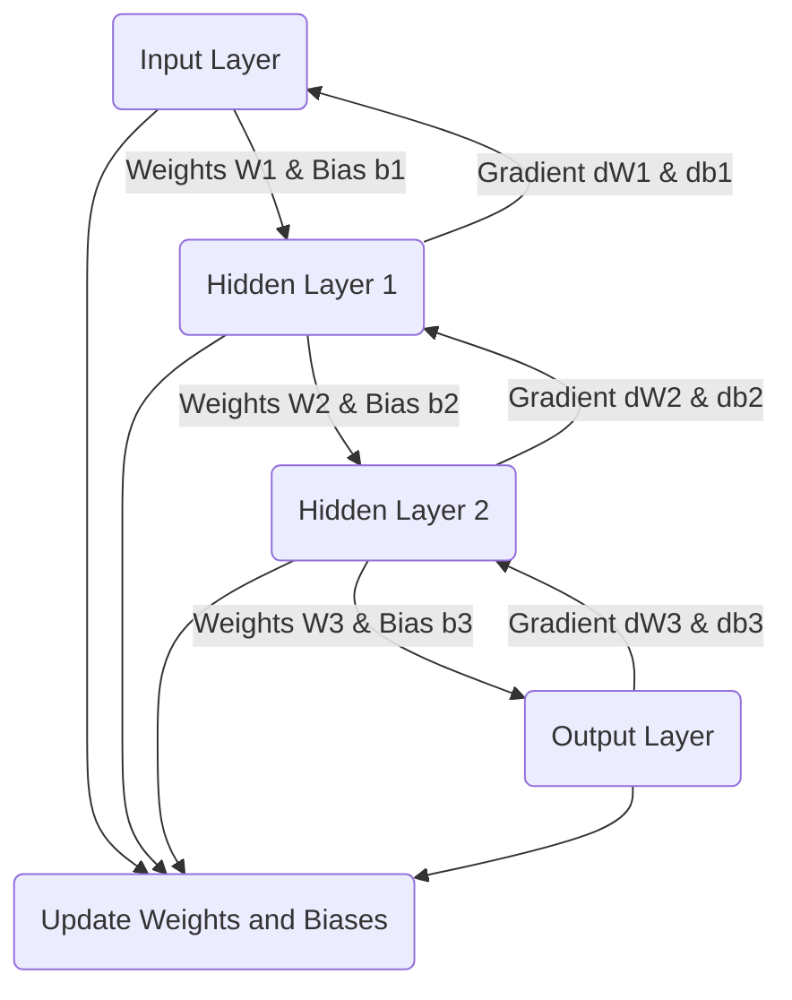

In our quest for a more **efficient** and **faster** machine learning model, we often turn to optimizing our tools and techniques. In this blog post, we'll explore how we can significantly improve the performance of a Java-based neural network by leveraging the power of matrix operations provided by **Apache Commons Math**.

* toc
{:toc}

# Prerequisites
Before we dive into the development process, ensure you have:
* JBang installed on your system. You can install it from [JBang's official website](https://www.jbang.dev/download/).

* You can clone the `https://github.com/dmakariev/examples` repository.
```bash
git clone https://github.com/dmakariev/examples.git
cd examples/artificial-intelligence/neural-network-compare
```

# Reimagining the `NeuralNetTutorial` Class
In [previous iterations](https://www.makariev.com/blog/crafting-neural-network-in-one-file-java-with-jbang/), our `NeuralNetTutorial` class relied on a straightforward, but less efficient, implementation using a `Neuron` class for [computations](https://www.makariev.com/blog/crafting-neural-network-in-one-file-java-with-jbang/#equation-for-the-output-of-a-neuron). Each neuron was responsible for processing its inputs and forwarding its output to subsequent layers. While this approach is conceptually simple and aligns with our understanding of how neural networks operate, it does not fully exploit modern CPU capabilities.

To step up our game, we have decided to reimplement these computations using [matrix operations](https://commons.apache.org/proper/commons-math/userguide/linear.html).
This shift is more than a technical tweak—it's a complete re-envisioning of how data flows through our network.
 
## Why Matrix Operations?

Matrix operations are not only mathematically elegant but also exceptionally well-suited for optimization by modern CPUs and mathematical libraries. By expressing neural network computations in terms of matrix operations, we can perform batch processing on data, utilize optimized mathematical functions, and even pave the way for leveraging GPU acceleration in the future.

## The Role of Apache Commons Math

[Apache Commons Math](https://commons.apache.org/proper/commons-math/index.html), a library rich with mathematical tools, offers a robust set of matrix operations that we can use to replace our manual, loop-based calculations. By doing so, we tap into highly optimized algorithms that are the product of decades of mathematical research and software optimization. 

# Neural Network Computations as Matrix Operations

## Forward Propagation
In a neural network, the forward propagation can be expressed as a series of matrix multiplications and additions. For a given layer $l$, with inputs $x$, weights $W$, biases $b$, and activation function $f$, the output $a$ is calculated as follows:
 
$ \mathbf{z}^{[l]} = \mathbf{W}^{[l]} \cdot \mathbf{x}^{[l-1]} + \mathbf{b}^{[l]} $

$ \mathbf{a}^{[l]} = f(\mathbf{z}^{[l]}) $

where:
* $ \mathbf{z}^{[l]}$ is the vector of weighted sums for layer $l$,
* $ \mathbf{W}^{[l]}$ is the weight matrix for layer $l$,
* $ \mathbf{x}^{[l-1]}$ is the output vector from the previous layer (or the input vector for ($l=1$),
* $ \mathbf{b}^{[l]}$ is the bias vector for layer $l$,
* $ \mathbf{a}^{[l]}$ is the output vector after applying the activation function for layer $l$,
* $f$ is the activation function (like sigmoid, ReLU, etc.).
 
## Backpropagation
During backpropagation, gradients are computed for each weight and bias in the network. For the output layer 
$L$, given the loss function $\mathcal{L}$, the gradient with respect to the weights is: 
 
$ \frac{\partial \mathcal{L}}{\partial \mathbf{W}^{[L]}} = \frac{\partial \mathcal{L}}{\partial \mathbf{a}^{[L]}} \cdot \frac{\partial \mathbf{a}^{[L]}}{\partial \mathbf{z}^{[L]}} \cdot (\mathbf{a}^{[L-1]})^\top $


For earlier layers, this expands to account for the recursive nature of backpropagation, incorporating the derivative of the activation function and the gradients from later layers.


## Neural Network Architecture 
The following is the architecture of a simple multi-layer perceptron:


 

By translating these concepts into code, we benefit from the highly optimized linear algebra operations provided by libraries like Apache Commons Math. These operations are not only executed more quickly but are also parallelizable, which further enhances the speed and efficiency of training neural networks.

To incorporate this in the Java code we discussed earlier, we would use Apache Commons Math's `RealMatrix` operations to perform the calculations for forward and backward propagation as described by the equations above. The efficient handling of these operations under the hood is what leads to performance improvements.

# The Code: A New Look `SimpleMLP.java`

```java
//DEPS org.apache.commons:commons-math3:3.6.1
//SOURCES ActivationFunction.java
package com.makariev.examples.ai.neuralnet;

import java.util.ArrayList;
import java.util.List;
import java.util.Random;
import org.apache.commons.math3.analysis.UnivariateFunction;
import org.apache.commons.math3.linear.ArrayRealVector;
import org.apache.commons.math3.linear.MatrixUtils;
import org.apache.commons.math3.linear.RealMatrix;
import org.apache.commons.math3.linear.RealVector;

public class SimpleMLP {

    private final RealMatrix[] weights;
    private final RealMatrix[] biases;
    private final Random random = new Random();

    private static final ActivationFunction ACTIVATION_FUNCTION = ActivationFunction.leakyReLU();
    //private static final ActivationFunction ACTIVATION_FUNCTION = ActivationFunction.ReLU();    
    //private final static ActivationFunction ACTIVATION_FUNCTION = ActivationFunction.tanh();
    //private final static ActivationFunction ACTIVATION_FUNCTION = ActivationFunction.sigmoid();

    private static final UnivariateFunction FUNCTION = ACTIVATION_FUNCTION::function;
    private static final UnivariateFunction FUNCTION_DERIVATIVE = ACTIVATION_FUNCTION::functionDerivative;

    public SimpleMLP(int... layerSizes) {
        final long startTime = System.currentTimeMillis();
        this.weights = new RealMatrix[layerSizes.length - 1];
        this.biases = new RealMatrix[layerSizes.length - 1];

        for (int i = 0; i < layerSizes.length - 1; i++) {
            weights[i] = MatrixUtils.createRealMatrix(layerSizes[i + 1], layerSizes[i]);
            biases[i] = MatrixUtils.createColumnRealMatrix(new double[layerSizes[i + 1]]);
            double stddev = Math.sqrt(2.0 / layerSizes[i]); // Standard deviation for He initialization
            for (int row = 0; row < layerSizes[i + 1]; row++) {
                for (int col = 0; col < layerSizes[i]; col++) {
                    weights[i].setEntry(row, col, random.nextGaussian() * stddev);
                }
                biases[i].setEntry(row, 0, 0.0);  // Biases can be initialized to 0
            }
        }
        System.out.printf("finished initialization in %dms\n", (System.currentTimeMillis() - startTime));
    }

    public double[] predict(double[] input) {
        return feedforward(new ArrayRealVector(input)).toArray();
    }

    private RealVector feedforward(RealVector input) {
        RealVector a = input;
        for (int i = 0; i < weights.length; i++) {
            a = weights[i].operate(a).add(biases[i].getColumnVector(0));
            a.mapToSelf(FUNCTION);
        }
        return a;
    }

    public void train(double[] input, double[] target, double learningRate) {
        train(new ArrayRealVector(input), new ArrayRealVector(target), learningRate);
    }

    private void train(RealVector input, RealVector target, double learningRate) {
        // Forward pass
        List<RealVector> activations = new ArrayList<>();
        activations.add(input);

        List<RealVector> zs = new ArrayList<>();

        RealVector a = input;
        for (int i = 0; i < weights.length; i++) {
            RealVector z = weights[i].operate(a).add(biases[i].getColumnVector(0));
            zs.add(z);
            a = z.map(FUNCTION);
            activations.add(a);
        }

        // Backward pass
        RealVector delta = activations.get(activations.size() - 1).subtract(target);
        for (int i = weights.length - 1; i >= 0; i--) {
            RealMatrix weightGradient = delta.outerProduct(activations.get(i));

            weights[i] = weights[i].subtract(weightGradient.scalarMultiply(learningRate));
            biases[i] = biases[i].subtract(MatrixUtils.createColumnRealMatrix(delta.toArray()).scalarMultiply(learningRate));

            if (i > 0) {
                RealVector sp = zs.get(i - 1).map(FUNCTION_DERIVATIVE);
                delta = weights[i].transpose().operate(delta).ebeMultiply(sp);
            }
        }
    }
}

``` 

The code snippet you've just seen is the embodiment of this new approach. Our `SimpleMLP` class now constructs **matrices** for weights and biases, initializing them using the **He initialization** method for better performance in deep networks. Gone are the days of iterating over individual neurons—now, a single line of code can apply a weight matrix to an entire layer of inputs

## Training on the MNIST Data
The `trainMLP_Mnist.java` is our training ground. 

```java
//usr/bin/env jbang "$0" "$@" ; exit $?
//SOURCES SimpleMLP.java
//SOURCES TrainingData.java
package com.makariev.examples.ai.neuralnet;

public class trainMLP_Mnist {

    public static void main(String[] args) {
        final long startTime = System.currentTimeMillis();

        // Example: Assuming the data has 784 inputs, 64 hidden neurons, and 10 output
        final SimpleMLP myMLP = new SimpleMLP(784, 64, 10);

        final TrainingData trainData = TrainingData.mnistTrainData();

        double learningRate = 0.001;
        // Train
        for (int epoch = 0; epoch < 5; epoch++) {

            trainData.trainLine((inputVals, targetVals) -> {

                double[] input = inputVals;
                for (int n = 0; n < input.length; n++) {
                    // normalization
                    // Scale the pixel values to the range [0,1]
                    input[n] = input[n] / 255;
                }

                double[] target = new double[10];
                target[(int) targetVals[0]] = 1;  // One-hot encoding

                // Train the MLP with the current sample
                myMLP.train(input, target, learningRate);
                return true;
            });

            // Test and Calculate Accuracy for the Epoch
            trainData.testPredictChunk(
                    10_000,
                    "Epoch: %d, Learning Rate: %.6f, ".formatted(epoch, learningRate),
                    (inputVals, targetVals) -> {
                        double[] input = inputVals;
                        for (int n = 0; n < input.length; n++) {
                            // normalization
                            // Scale the pixel values to the range [0,1]
                            input[n] = input[n] / 255;
                        }
                        final double[] predictions = myMLP.predict(input);
                        final int predictedLabel = TrainingData.getMaxIndex(predictions);
                        return predictedLabel == (int) targetVals[0];
                    }
            );
        }

        System.out.println();

        // Test and Calculate Accuracy 
        trainData.testPredictChunk(10_000, (inputVals, targetVals) -> {
            double[] input = inputVals;
            for (int n = 0; n < input.length; n++) {
                // normalization
                // Scale the pixel values to the range [0,1]
                input[n] = input[n] / 255;
            }
            final double[] predictions = myMLP.predict(input);
            final int predictedLabel = TrainingData.getMaxIndex(predictions);
            return predictedLabel == (int) targetVals[0];
        });

        System.out.println("\nexecution time: " + (System.currentTimeMillis() - startTime) + "ms\n");

    }

}

```


Here we load the MNIST training data, normalize it by scaling pixel values to the range [0,1], and then train our network. We use the [backpropagation algorithm](https://www.makariev.com/blog/crafting-neural-network-in-one-file-java-with-jbang/#backpropagation) to adjust the weights of the network.

Training is done over multiple epochs, with each pass the network learning a bit more about the handwritten digits it sees. We also implement a mechanism to track and reduce the error over time.

## Seeing the Results in Action
As we run our training script, we print out the network's accuracy at the end of each epoch, observing as it (hopefully) increases with each pass. The excitement comes in watching the network's predictions improve, transforming from random guesses to confident, accurate classification.

Using **He Initialization** with [Leaky ReLU](https://www.makariev.com/blog/crafting-neural-network-in-one-file-java-with-jbang/#leaky-relu-activation-function) 
```bash
jbang trainMLP_Mnist.java
[jbang] Building jar for trainMLP_Mnist.java...
finished initialization in 17ms
Epoch: 0, Learning Rate: 0.001000, Accuracy: 92.53% 
Epoch: 1, Learning Rate: 0.001000, Accuracy: 94.37% 
Epoch: 2, Learning Rate: 0.001000, Accuracy: 95.00% 
Epoch: 3, Learning Rate: 0.001000, Accuracy: 95.51% 
Epoch: 4, Learning Rate: 0.001000, Accuracy: 95.75% 

Accuracy: 95.75% 

execution time: 52415ms
```

Here are the results from the `NeuralNetTutorial` Class using exactly the same **He Initialization** with [Leaky ReLU](https://www.makariev.com/blog/crafting-neural-network-in-one-file-java-with-jbang/#leaky-relu-activation-function) 
```bash
jbang trainNNT_Mnist.java 
[jbang] Building jar for trainNNT_Mnist.java...
finished initialization
Epoch: 0, Accuracy: 81.50% 
Epoch: 1, Accuracy: 89.11% 
Epoch: 2, Accuracy: 90.78% 
Epoch: 3, Accuracy: 91.88% 
Epoch: 4, Accuracy: 92.33% 

Accuracy: 92.33% 

execution time: 147053ms
```
As you can see by the results above, the Matrix implementation is almost 3x times faster then the old loop based `Neuron` class implementations. 

## Performance Gains
One of the most compelling reasons for this change is the significant performance improvement. Matrix operations are not only theoretically faster but, thanks to Apache Commons Math, they are faster in practice. In benchmarks, we've observed a substantial decrease in the time required to train our network on the MNIST dataset, which means faster iteration times and more efficient learning.

## Future-Proofing
With this new implementation, we're not just improving performance; we're also setting the stage for future enhancements. The use of matrix operations aligns well with practices in high-performance computing and opens the door to further optimizations and scalability improvements.

# Conclusion
In summary, the shift to matrix operations in our Java neural network represents a leap forward in both performance and future potential. By harnessing the capabilities of Apache Commons Math, we've created a more efficient and scalable machine learning tool.

---

Whether you're an experienced Java developer or new to the field, this blog post should pique your interest in the power of matrix operations and the utility of libraries like Apache Commons Math in machine learning. Now is a great time to dive into the code, experiment with the SimpleMLP class, and witness the speedup for yourself. 

---

[](/assets/img/blog/mnist-coffee-2.jpg)

Happy coding!


